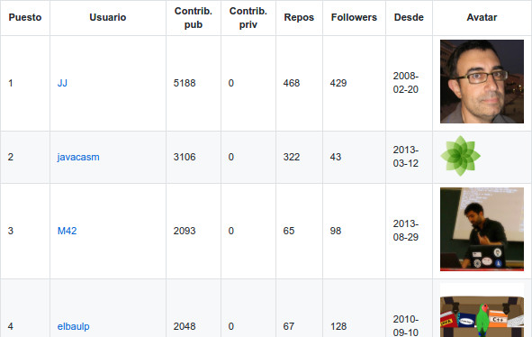

# GitHubRankingsSpain

## What is this?
This repository contains a set of rankings:
* One ranking is generated for each Spanish's province.
* With all the rankings of a region (
autonomous community or the complete country), the ranking of this region is generated.

**What kind of rankings?**: rankings with the GitHub's users. This rankings are based on the location of the different user of GitHub. Then, the results are sorted by number of **public contributions**.

## How this dataset is generated?
This repository contains the results of [GitHubSpanishRankingGenerator](https://github.com/iblancasa/GitHubSpanishRankingGenerator).

To generate the rankings, it is necessary to use [GitHubCity](https://github.com/iblancasa/GitHubCity). It is also available at [Pypi](https://pypi.python.org/pypi/githubcity/).

### Original idea
[Original idea](https://github.com/JJ/top-github-users-data) by [@jj](https://github.com/JJ/)

### License 

    (c) by Israel Blancas

    This repository is licensed under a
    Creative Commons Attribution 4.0 International License.

    You should have received a copy of the license along with this
    work. If not, see <http://creativecommons.org/licenses/by/4.0/>.
